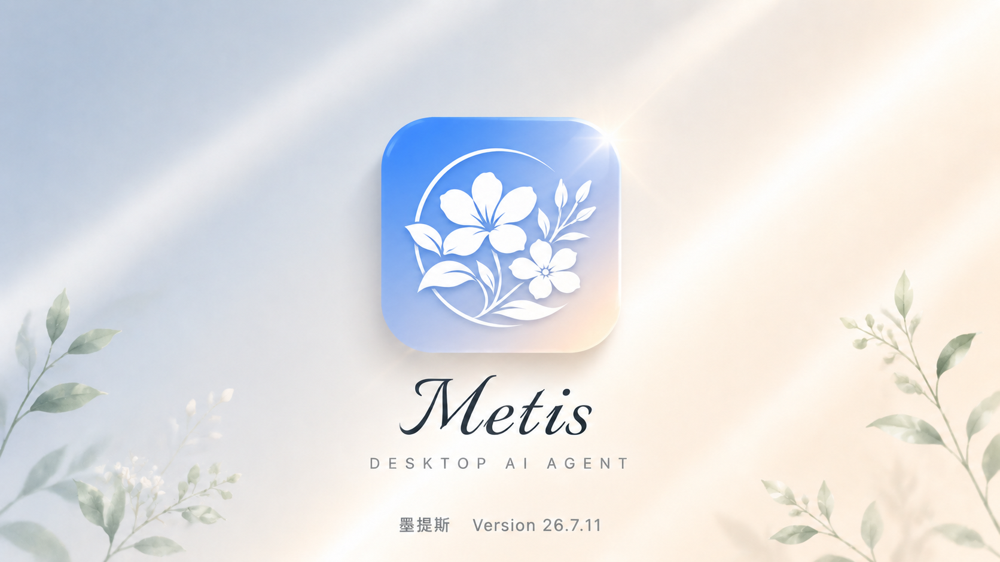
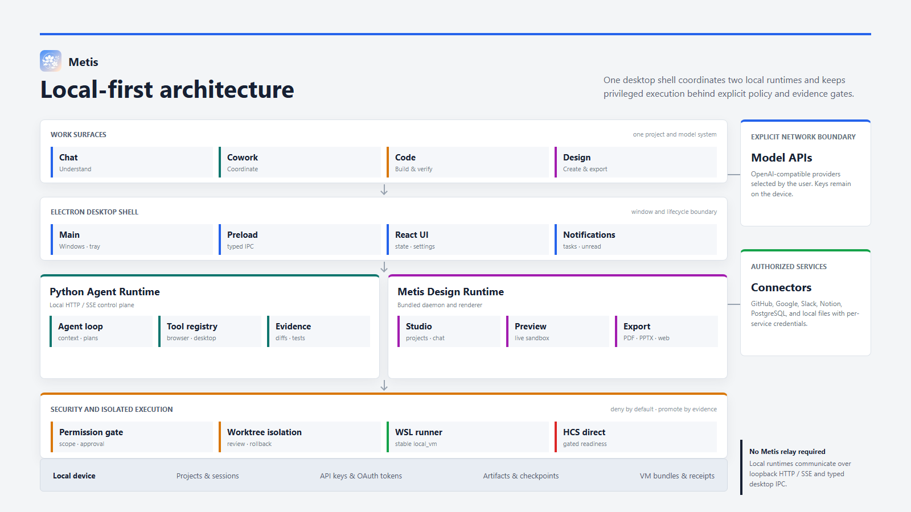

<div align="center">



# Metis · 墨提斯

**Connect models to code, terminals, browsers, and Windows, then carry a goal through to verifiable results.**

[](https://github.com/linyeping/Metis/releases/latest)
[](https://github.com/linyeping/Metis/actions/workflows/ci.yml)


**[Download 26.7.11](https://github.com/linyeping/Metis/releases/tag/v26.7.11) · [Release notes](desktop/release/RELEASE_NOTES_v26.7.11.md) · [中文](README.md)**

Built by [linyeping](https://github.com/linyeping) · Product direction and design acknowledgements: [Serein](https://github.com/Serein0812)

</div>

---

## From Intent to Evidence

Metis is not a chat window with a few tool buttons. It is a **local AI execution workbench** that brings reasoning, project context, tool calls, permission control, and verification into one desktop workflow:

```text
Goal -> Plan -> Execute -> Observe -> Verify -> Deliver
          ^                              |
          +--------- iterate ------------+
```

It can understand a repository, edit files, run commands, inspect web applications, operate Windows software, and attach diffs, tests, screenshots, logs, and generated artifacts as completion evidence. Sessions, task state, and audit history remain available so long-running work can recover instead of restarting from zero.

> **Local-first by design**: filesystem, terminal, browser, and desktop actions run on your machine. Metis requires no platform account, ships no built-in telemetry, and does not relay API keys or OAuth tokens through a Metis service.

---

## Get Metis

| | |
|---|---|
| Current release | **26.7.11** |
| Platform | Windows 10 / 11, 64-bit |
| Installer | [Download Metis-Setup-26.7.11.exe](https://github.com/linyeping/Metis/releases/download/v26.7.11/Metis-Setup-26.7.11.exe) |
| Model access | DeepSeek or any OpenAI-compatible API |

The installer is not code-signed yet, so Windows SmartScreen may display a warning. Download from this repository's GitHub Release and verify the release version.

## Three Work Surfaces

Metis separates different kinds of work into three focused surfaces instead of forcing every workflow through one conversation stream.

| Surface | Best for | Execution model |
|---|---|---|
| **Chat** | Questions, analysis, research, and lightweight file work | Fast response with tools activated as needed |
| **Cowork** | Multi-step deliverables, research synthesis, and cross-tool work | Plan-driven execution with sub-tasks and evidence aggregation |
| **Code** | Repository understanding, implementation, tests, and builds | Workspace-aware execution centered on diffs and verification |

Sessions, workspaces, and drafts are isolated by mode. Rapid navigation cannot let an older request overwrite the visible session or leak another mode's workspace into a new task.

## Verifiable Execution

| Capability | How Metis works | What you can inspect |
|---|---|---|
| **Code & Terminal** | Searches code, performs structured edits, runs Git/CLI commands, tests, and builds | Diffs, terminal output, test conclusions, generated files |
| **Preview Browser** | Navigates, clicks, types, observes DOM state, and captures console/network failures | Page state, screenshots, DOM, console, and network evidence |
| **Computer Use** | Operates mouse and keyboard from window-level observations in an `observe -> act -> verify` loop | Action trail, window captures, step state, and results |
| **Store & Connectors** | Installs skills, tools, and service connectors with concrete capability descriptions | Traceable source, brand identity, and connection state |
| **Long-running Work** | Compacts context, checkpoints sessions, tracks background runs, reconnects, and resumes | Recoverable sessions, progress, compaction boundaries, artifacts |

## Trust Boundaries

- **Local-first execution**: filesystem, terminal, browser, and desktop tools run on the user's device.
- **Layered permissions**: reads, writes, deletes, and external submissions flow through risk-aware policy and approval controls.
- **Inspectable activity**: tool cards expose status, duration, summaries, and expandable results; background runs have a dedicated activity view.
- **Credential isolation**: API keys and OAuth tokens are excluded from logs and model context; OAuth tokens are encrypted at rest.
- **Evidence over claims**: completion can be grounded in tests, diffs, screenshots, logs, or generated artifacts rather than model text alone.

## What's New in 26.7.11

- Rolled out the new rounded flower identity across the desktop app, tray, Store, and Windows installer.
- Added colored connector branding and concrete, searchable capability descriptions in Chinese and English.
- Added configurable close-window behavior: ask, minimize to tray, or quit. Minimize to tray remains the default.
- Reworked Chat / Cowork / Code navigation to reduce duplicate loads and prevent stale-session races during rapid switching.

---

## Product Interface

<div align="center">

</div>

The interface is organized for continuous work: the central thread carries goals and outcomes; the right workbench hosts Preview, Diff, Terminal, Files, and background Activity; Settings centralizes models, permissions, runtime management, connectors, and desktop behavior.

---

## Architecture

<div align="center">

</div>

```text
Metis Desktop
├─ Electron main process
│  ├─ Windowing, menus, OAuth, WebContentsView Preview
│  ├─ Backend lifecycle management
│  └─ Windows packaging entry
├─ React renderer
│  ├─ Chat / Tool Activity / Right Rail / Settings
│  ├─ Browser Activity / Preview Browser UI
│  └─ Zustand stores + assistant-ui message stream
└─ Python backend
   ├─ Flask + SSE API
   ├─ agent_loop / tool_registry / skills
   ├─ browser automation / desktop automation
   ├─ provider adapters
   └─ checkpoint / context budget / connectors
```

Communication model:

- The renderer talks to the backend over HTTP / SSE.
- The Electron main process owns local preview, OAuth, packaged backend startup, and desktop shell capabilities.
- Backend tools interact with the local filesystem, terminal, browser, desktop automation, and model APIs.

---

## Requirements

| Item | Requirement |
|---|---|
| OS | Windows 10 / 11 64-bit |
| Node.js | Required for development mode; not required for installed users |
| Python | Required for development mode; bundled into the packaged backend |
| Network | Required for model API calls |
| API key | DeepSeek or any OpenAI-compatible endpoint |
| Desktop control | `/computer` controls mouse and keyboard; sensitive actions should be confirmed by the user |

This build is not code-signed yet, so Windows SmartScreen may warn before launch.

---

## Development

```powershell
python -m pip install -e backend/

cd desktop
npm ci
npm run dev
```

Development mode starts:

- Vite renderer: `http://127.0.0.1:5174` by default
- Electron desktop shell
- Local Python backend managed by the Electron launcher

---

## Common Commands

```powershell
# Frontend type check
cd desktop
npm run typecheck

# Frontend unit tests
npm run test

# Electron / security / contract tests
npm run test:contracts

# Backend tests
cd ..
python -m pytest backend/tests/ -q

# Production renderer build
cd desktop
npm run build
```

---

## Build a Windows EXE

```powershell
cd desktop
npm run dist:win
```

`dist:win` runs:

1. `npm run build-backend`: bundles the Python backend with PyInstaller.
2. `npm run build`: builds the React/Vite renderer.
3. `electron-builder --win nsis`: produces a Windows NSIS installer.

Output location:

```text
desktop/release/
```

To verify only the production renderer build:

```powershell
cd desktop
npm run build
```

---

## Project Structure

```text
Miro/
├── backend/
│   ├── bridges/        # event contracts and provider/tool protocol bridges
│   ├── runtime/        # agent loop, tool registry, skills, checkpoint, context budget
│   ├── tools/          # code, browser, desktop, retrieval, and other tools
│   ├── web/            # Flask API, SSE, Preview Browser bridge
│   └── assets/         # cover, architecture, and feature showcase images
├── desktop/
│   ├── electron/       # Electron main/preload, OAuth, packaging entry
│   ├── src/            # React UI, stores, runtime, i18n
│   └── scripts/        # build, contract, and smoke scripts
├── docs/               # development logs and design documents
└── README.md / README.en.md
```

---

## Privacy and Safety

- Metis does not require a platform account and does not include built-in telemetry.
- API keys and OAuth tokens stay in local configuration/encrypted storage.
- Connector tokens are not inserted into model context.
- Tool actions are audited for traceability.
- `/computer` and `/browser` distinguish reading information from sending or submitting data; external side effects, sensitive data, deletion, uploads, and authorization changes should be confirmed first.

---

## License

**[PolyForm Noncommercial 1.0.0](LICENSE)** © 2026 linyeping

Source-available, **free for personal / non-commercial use** including learning, research, personal projects, and nonprofits.
**Any commercial use or commercial derivative work requires prior written paid authorization from the author**.

---

<div align="center">

**Built by [linyeping](https://github.com/linyeping)** · Product direction and part of the design thinking: [Serein](https://github.com/Serein0812) · The wise stay quiet; the skilled never run dry.

</div>
