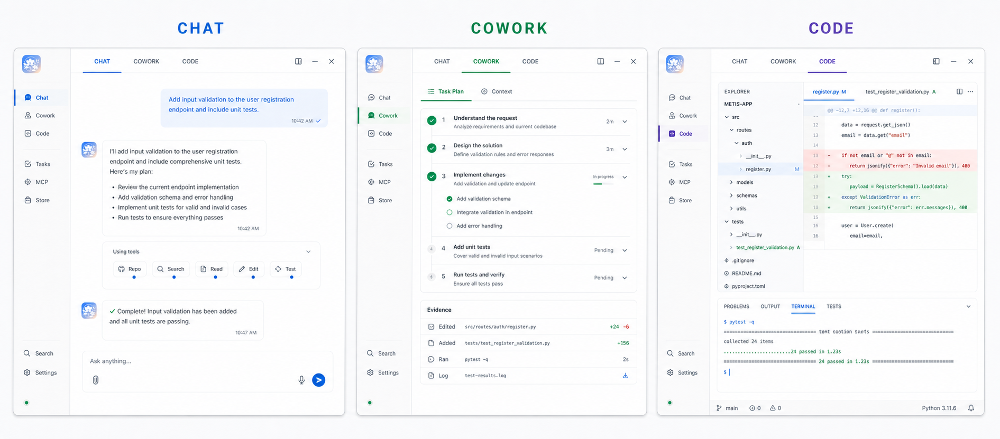

<div align="center">


# Metis

**Connect models to code, terminals, browsers, and Windows, then carry a goal through to verifiable results.**

<p>
  
  
  
  
  
</p>

<p>
  <a href="https://github.com/linyeping/Metis/releases/download/v26.7.27/Metis-Setup-26.7.27.exe"></a>
  <a href="https://github.com/linyeping/Metis/releases/tag/v26.7.27"></a>
</p>

<sub>Windows 10 / 11 · 64-bit · DeepSeek / OpenAI-compatible API</sub><br />
<sub><a href="README.md">中文</a> · Built by <a href="https://github.com/linyeping">linyeping</a> · Product direction and design acknowledgements: <a href="https://github.com/Serein0812">Serein</a></sub>

</div>

<br />

<h2 align="center">One Workbench, Four Work Surfaces</h2>

<p align="center">
  Each task enters the surface that fits it best while sharing the same models, projects, tools, permissions, and notifications.
</p>

<p align="center">
  
</p>

<p align="center">
  <b>CHAT</b> fast understanding and light execution &nbsp;·&nbsp;
  <b>COWORK</b> plan-driven multi-step delivery &nbsp;·&nbsp;
  <b>CODE</b> repository-centered engineering loop &nbsp;·&nbsp;
  <b>DESIGN</b> conversational, deliverable design
</p>

<p align="center"><sub>Sessions, workspaces, and drafts stay isolated by mode, so rapid navigation cannot let stale requests overwrite the active record.</sub></p>

<br />

<h2 align="center">Metis Design: From One Prompt to a Deliverable</h2>

<p align="center">
  Project management, agent chat, live preview, and export form one integrated Metis work surface.
</p>

<table align="center" width="100%">
  <tr>
    <td width="50%" valign="top">
      <b>Project home and split Studio</b><br /><br />
      Create or open a design project, direct the agent on the left, and inspect the result on the right. Projects, sessions, and design systems remain local.
    </td>
    <td width="50%" valign="top">
      <b>Rendered work, not static mockups</b><br /><br />
      Generate web, desktop, and mobile prototypes, decks, images, and interactive artifacts, then inspect them in a sandboxed live preview.
    </td>
  </tr>
  <tr>
    <td width="50%" valign="top">
      <b>Complete export pipeline</b><br /><br />
      Export HTML, PDF, PPTX, images, Markdown, and project bundles with consistent progress, completion, and failure notifications.
    </td>
    <td width="50%" valign="top">
      <b>Part of the Metis system</b><br /><br />
      Design follows Metis theme, locale, model configuration, task notifications, and desktop-pet state, with direct navigation back to Chat, Cowork, or Code.
    </td>
  </tr>
</table>

<br />

<h2 align="center">Not Just Answers. Finished Work.</h2>

<p align="center">
  Metis brings model reasoning, project context, tool calls, permission control, and verification into one local workflow.
</p>

<div align="center">
  
</div>

<table align="center" width="100%">
  <tr>
    <td width="50%" valign="top">
      <b>From intent to evidence</b><br /><br />
      Understand the repository and context → build a plan → edit files and run commands → inspect web or Windows apps → collect diffs, tests, screenshots, logs, and artifacts.
    </td>
    <td width="50%" valign="top">
      <b>Long-running continuity</b><br /><br />
      Context compaction, checkpoints, background runs, reconnect, and resume keep work moving while progress and final artifacts remain inspectable.
    </td>
  </tr>
  <tr>
    <td width="50%" valign="top">
      <b>Local-first</b><br /><br />
      Filesystem, terminal, browser, and desktop tools run on the user's device, with no platform account requirement and no built-in telemetry.
    </td>
    <td width="50%" valign="top">
      <b>Verifiable delivery</b><br /><br />
      Tool calls, duration, summaries, and results stay visible. Completion is backed by tests, diffs, screenshots, or logs instead of a bare “done.”
    </td>
  </tr>
</table>

<br />

<h2 align="center">Connect the Services You Already Use</h2>

<p align="center">
  &nbsp;&nbsp;&nbsp;
  &nbsp;&nbsp;&nbsp;
  &nbsp;&nbsp;&nbsp;
  &nbsp;&nbsp;&nbsp;
  &nbsp;&nbsp;&nbsp;
  &nbsp;&nbsp;&nbsp;
  &nbsp;&nbsp;&nbsp;
  
</p>

<p align="center"><sub>The Store and connector center expose concrete capabilities, provenance, authorization, available tools, and live connection state.</sub></p>

<br />

<details>
  <summary><b>What's new in 26.7.27</b></summary>
  <br />
  <ul>
    <li>Added Thinking Orbs driven by real runtime events for task understanding, search, tool execution, and response composition.</li>
    <li>Moved live runtime status into the current assistant turn instead of reserving space above the composer.</li>
    <li>Added concise user-facing activity copy while retaining turn, step, and elapsed-time details.</li>
    <li>Matched the inline animation pacing to the original repository demo and removed the transient heartbeat icon before failures.</li>
  </ul>
</details>

<br />

---

<h2 align="center">Local Architecture</h2>

<div align="center">
  
</div>

<table align="center" width="100%">
  <tr>
    <td width="33%" valign="top"><b>Electron Desktop</b><br /><sub>Windowing, menus, OAuth, WebContentsView Preview, and packaged backend lifecycle.</sub></td>
    <td width="34%" valign="top"><b>React Workbench</b><br /><sub>Chat / Cowork / Code / Design, tool activity, right workbench, settings, and state management.</sub></td>
    <td width="33%" valign="top"><b>Python Agent</b><br /><sub>Flask + SSE, agent loop, tool registry, skills, browser and desktop automation, checkpoints, and connectors.</sub></td>
  </tr>
</table>

> [!NOTE]
> The renderer talks to the local backend over HTTP / SSE. API keys and OAuth tokens never pass through a Metis relay and stay out of logs and model context.

---

## Requirements

| Item | Requirement |
|---|---|
| OS | Windows 10 / 11 64-bit |
| Node.js | Required for development mode; not required for installed users |
| Python | Required for development mode; bundled into the packaged backend |
| Network | Required for model API calls |
| API key | DeepSeek or any OpenAI-compatible endpoint |
| Desktop control | `/computer` controls mouse and keyboard; sensitive actions should be confirmed by the user |

This build is not code-signed yet, so Windows SmartScreen may warn before launch.

---

## Development

```powershell
python -m pip install -e backend/

cd desktop
npm ci
npm run dev
```

Development mode starts:

- Vite renderer: `http://127.0.0.1:5174` by default
- Electron desktop shell
- Local Python backend managed by the Electron launcher

### Headless CLI

Metis also provides a one-shot CLI for scripts and CI. It reuses the same model resolution, agent loop, tools, permission rules, and the `metis.agent_event.v1` event contract.

```powershell
# Run from source
"Inspect this repository and report the result" | python -m backend -p `
  --workspace . `
  --permission-mode plan `
  --output-format stream-json `
  --no-desktop

# Build a single-file CLI that needs no system Python or Node.js
cd desktop
npm run build-cli
```

The CLI supports human-readable `text`, one final `json` object, and event-by-event `stream-json`. A headless run never waits for an unavailable approval UI: when a tool requires confirmation, it emits a redacted error and exits with code `2`. The build output is `desktop/release/metis.exe`; run `metis --help` for the complete P0 command surface.

The standalone CLI reads model settings from `~/.metis/config.json`, `~/.metis/settings.json`, and workspace `.metis/settings.json`. On Windows, desktop and CLI share the API key through the current user's Windows Credential Manager, so configuration files do not contain plaintext secrets. Legacy Electron `safeStorage` and plaintext configurations migrate automatically after the desktop starts. Ephemeral automation can still inject `METIS_LLM_API_KEY`, which takes precedence over the system credential.

---

## Common Commands

```powershell
# Frontend type check
cd desktop
npm run typecheck

# Frontend unit tests
npm run test

# Electron / security / contract tests
npm run test:contracts

# Backend tests
cd ..
python -m pytest backend/tests/ -q

# Production renderer build
cd desktop
npm run build
```

---

## Build a Windows EXE

```powershell
cd desktop
npm run dist:win
```

`dist:win` runs:

1. `npm run build-backend`: bundles the Python backend with PyInstaller.
2. `npm run build`: builds the React/Vite renderer.
3. `electron-builder --win nsis`: produces a Windows NSIS installer.

Output location:

```text
desktop/release/
```

To verify only the production renderer build:

```powershell
cd desktop
npm run build
```

---

## Project Structure

```text
Miro/
├── backend/
│   ├── cli/            # headless lifecycle, config merge, output contract, permission fail-fast
│   ├── bridges/        # event contracts and provider/tool protocol bridges
│   ├── runtime/        # agent loop, tool registry, skills, checkpoint, context budget
│   ├── tools/          # code, browser, desktop, retrieval, and other tools
│   ├── web/            # Flask API, SSE, Preview Browser bridge
│   └── assets/         # cover, architecture, and feature showcase images
├── desktop/
│   ├── electron/       # Electron main/preload, OAuth, packaging entry
│   ├── src/            # React UI, stores, runtime, i18n
│   └── scripts/        # build, contract, and smoke scripts
├── open-design/         # bundled Metis Design editor and export-runtime source
└── README.md / README.en.md
```

---

## Privacy and Safety

- Metis does not require a platform account and does not include built-in telemetry.
- API keys and OAuth tokens stay in local configuration/encrypted storage.
- Connector tokens are not inserted into model context.
- Tool actions are audited for traceability.
- `/computer` and `/browser` distinguish reading information from sending or submitting data; external side effects, sensitive data, deletion, uploads, and authorization changes should be confirmed first.

---

## License

**[PolyForm Noncommercial 1.0.0](LICENSE)** © 2026 linyeping

Source-available, **free for personal / non-commercial use** including learning, research, personal projects, and nonprofits.
**Any commercial use or commercial derivative work requires prior written paid authorization from the author**.

---

<div align="center">

**Built by [linyeping](https://github.com/linyeping)** · Product direction and part of the design thinking: [Serein](https://github.com/Serein0812) · The wise stay quiet; the skilled never run dry.

</div>
