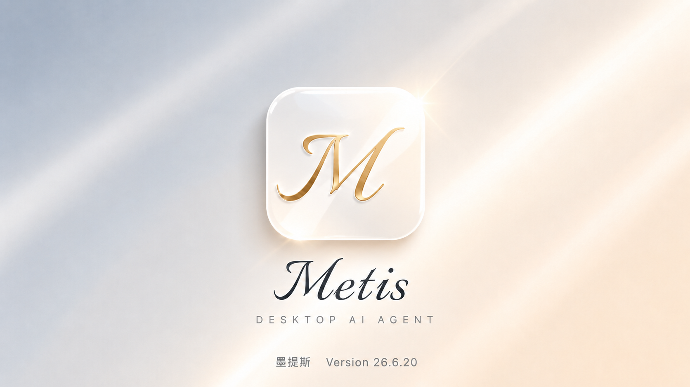
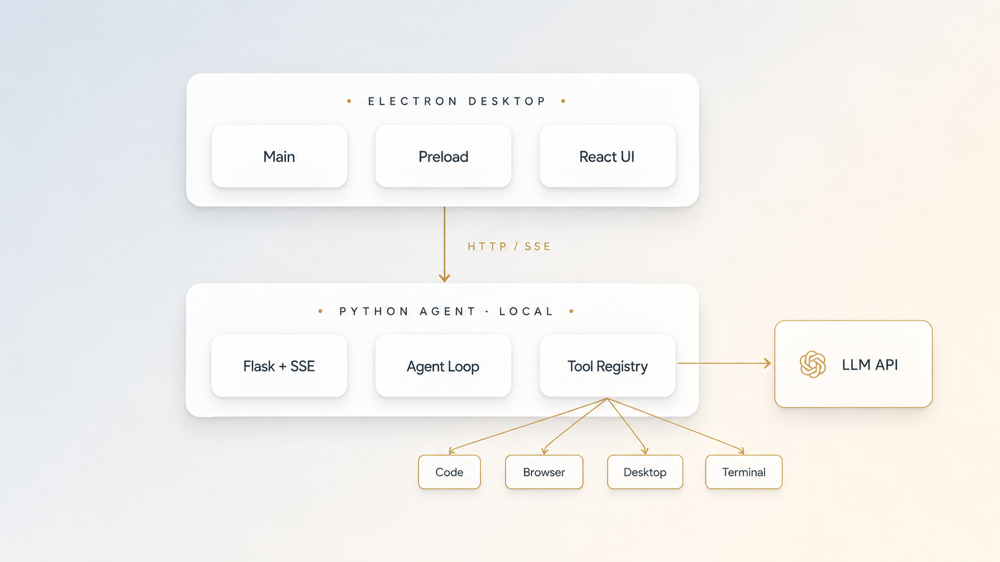

<div align="center">



# Metis · 墨提斯

**一个会写代码、跑终端、操控网页与桌面的本地 AI 智能体**

> 智者不喧，巧者不竭。


**由 [linyeping](https://github.com/linyeping) 打造**

**中文 · [English](README.en.md)**

</div>

---

## 这是什么

**Metis** 是一个桌面端 AI 工作台。它由 Electron + React 渲染层和本机 Python 智能体后端组成，模型通过 DeepSeek 或任意 OpenAI-compatible API 调用。你给它一个目标，它会规划步骤、调用工具、观察结果并继续推进。

Metis 的重点不是只聊天，而是把工作真的做完：

- 阅读、搜索、修改代码，生成 diff，并运行测试验证。
- 操控终端、Git、文件系统、本地项目和开发服务器。
- 通过右侧 Preview Browser 检查网页、点击、输入、截图、抓 console/network/DOM 诊断。
- 通过 `/computer` 操控 Windows 桌面软件，完成原生应用和跨软件流程。
- 用工具活动、任务清单、权限门禁和审计日志把执行过程透明地展示出来。

Metis 本身无需账号、无强制登录、无遥测。第三方连接器使用标准 OAuth，token 加密保存在本机。

---

## 最近核心能力

### Computer Use 桌面操控

`/computer` 面向 Windows 桌面应用和跨软件流程。当前实现采用：

- **Win2 runtime**：优先使用窗口级 Win32 能力，按目标窗口观察和执行，减少全屏坐标漂移。
- **结构化 action loop**：`observe -> plan -> act -> verify`，每次动作后重新观察并验证目标是否推进。
- **多源观察**：窗口截图、窗口清单、可访问性/结构化观察、必要时回退视觉识别。
- **Desktop Expert**：复杂桌面任务会委托给 `desktop_expert`，使用桌面专用工具集和更长轮次预算。
- **接管提示与活动卡**：执行时显示屏幕接管提示，聊天内工具活动会展示每一步状态、耗时和结果。
- **完成态修复**：工具结果丢失或 ID 变形时，会合并回原运行中工具卡；整轮结束时不再残留“desktop expert 正在运行”的假状态。

### Preview Browser / Browser Use

`/browser` 使用右侧 Preview Browser 完成本地网页和文件的自动化测试：

- 自动识别当前活跃 dev server，优先读取 `METIS_DESKTOP_DEV_SERVER`，并扫描常见端口如 `5173/5174/3000/4200/8000/8080`。
- 支持导航、点击、输入、DOM 观察、截图、刷新和右栏当前 URL 复用。
- 可抓取 console error/warning、network failed request、页面 JS exception、DOM 摘要、标题、URL、viewport 和截图证据。
- 内置 Browser Verifier：检查元素是否存在/可见、按钮是否可点击、输入框是否可输入、页面是否白屏、console 是否有 error、截图是否纯白/纯黑。
- Browser Activity 面板默认折叠，只在需要时展开，避免压缩真实网页预览空间。

### OAuth 与连接器

Metis 已具备连接器框架和 OAuth 基础设施：

- Electron 主进程负责 OAuth 回调、token 加密存储和安全边界。
- 设置页有连接器入口，支持后续 Gmail、GitHub 等第三方能力接入。
- token 不写入日志、不进入模型上下文、不经过中转服务。

### Context Engineering 与长任务稳定性

- 自动压缩上下文，保留任务摘要和可恢复边界。
- 工具结果可压缩，避免长输出把模型上下文撑爆。
- 支持运行恢复、后台 run 追踪、心跳重连和会话级 checkpoint。
- 工具契约统一为 SSE event contract，前端和后端用同一套事件语义。

---

## 功能一览

<div align="center">

</div>

| 模块 | 说明 |
|---|---|
| 智能体循环 | 计划、工具调用、观察、续写，支持截断续写、延迟工具激活和运行恢复 |
| 代码工具 | 读写文件、搜索代码、语义索引、AST/patch 修改、测试运行、diff 预览 |
| 终端工具 | 本地命令执行、环境诊断、构建和测试排查 |
| Browser Use | 右侧 Preview Browser 自动化、DOM/截图/console/network 诊断和验收 |
| Computer Use | Win2 桌面操控、窗口观察、鼠标键盘执行、视觉 fallback、Desktop Expert |
| 任务清单 | 自动展示当前计划、进行中步骤和完成情况 |
| 工具活动 | 每个工具卡展示状态、摘要、耗时、错误提示和可展开详情 |
| 权限模式 | 请求批准、替我审批、完全访问，按风险分级拦截敏感动作 |
| OAuth 连接器 | 本机 OAuth 回调、加密 token 存储，为 Gmail/GitHub 等能力预留 |
| 国际化 | 中文 / English 双语界面和文档 |
| 打包分发 | PyInstaller 打包 Python 后端，electron-builder 生成 Windows 安装包 |

---

## 架构

<div align="center">

</div>

```text
Metis Desktop
├─ Electron main process
│  ├─ 窗口、菜单、OAuth、WebContentsView Preview
│  ├─ 后端生命周期管理
│  └─ Windows 打包入口
├─ React renderer
│  ├─ Chat / Tool Activity / Right Rail / Settings
│  ├─ Browser Activity / Preview Browser UI
│  └─ Zustand stores + assistant-ui message stream
└─ Python backend
   ├─ Flask + SSE API
   ├─ agent_loop / tool_registry / skills
   ├─ browser automation / desktop automation
   ├─ provider adapters
   └─ checkpoint / context budget / connectors
```

通信方式：

- Renderer 与后端通过 HTTP / SSE 通信。
- Electron main 负责本地预览、OAuth、打包后的后端启动和桌面 shell 能力。
- 后端工具最终调用本地文件系统、终端、浏览器、桌面自动化和模型 API。

---

## 运行环境

| 项 | 要求 |
|---|---|
| 操作系统 | Windows 10 / 11 64 位 |
| Node.js | 开发模式需要 Node.js；安装包模式不要求用户手动安装 |
| Python | 开发模式需要 Python；安装包会内置后端运行时 |
| 网络 | 需要联网调用模型 API |
| API key | DeepSeek 或任意 OpenAI-compatible endpoint |
| 桌面操控 | `/computer` 会控制鼠标键盘，执行敏感动作前应由用户确认 |

当前版本尚未代码签名，Windows SmartScreen 可能提示风险，确认后可继续运行。

---

## 开发运行

```powershell
python -m pip install -e backend/

cd desktop
npm ci
npm run dev
```

开发模式会启动：

- Vite renderer：默认 `http://127.0.0.1:5174`
- Electron desktop shell
- 本机 Python backend：由 Electron launcher 管理

---

## 常用命令

```powershell
# 前端类型检查
cd desktop
npm run typecheck

# 前端单测
npm run test

# Electron / 安全 / 契约测试
npm run test:contracts

# 后端测试
cd ..
python -m pytest backend/tests/ -q

# 生产 renderer 构建
cd desktop
npm run build
```

---

## 打包 Windows EXE

```powershell
cd desktop
npm run dist:win
```

`dist:win` 会执行：

1. `npm run build-backend`：用 PyInstaller 打包 Python 后端。
2. `npm run build`：构建 React/Vite renderer。
3. `electron-builder --win nsis`：生成 Windows NSIS 安装包。

产物位置：

```text
desktop/release/
```

如果只想验证前端是否能生产构建：

```powershell
cd desktop
npm run build
```

---

## 项目结构

```text
Miro/
├── backend/
│   ├── bridges/        # 事件契约、供应商/工具协议桥接
│   ├── runtime/        # agent loop、工具注册、技能、checkpoint、context budget
│   ├── tools/          # 代码、浏览器、桌面、检索等工具实现
│   ├── web/            # Flask API、SSE、Preview Browser bridge
│   └── assets/         # 封面、架构图、功能展示图
├── desktop/
│   ├── electron/       # Electron main/preload、OAuth、打包入口
│   ├── src/            # React UI、stores、runtime、i18n
│   └── scripts/        # 构建、契约测试、冒烟测试脚本
├── docs/               # 开发日志和设计文档
└── README.md / README.en.md
```

---

## 隐私与安全

- Metis 不要求平台账号，不内置遥测。
- API key 和 OAuth token 存在本机配置/加密存储中。
- 连接器 token 不进入模型上下文。
- 工具动作有审计记录，便于回看和排查。
- `/computer` 和 `/browser` 会区分读取信息与发送/提交数据；涉及外部副作用、敏感数据、删除、上传、授权等操作时应先确认。

---

## 许可证

**[PolyForm Noncommercial 1.0.0](LICENSE)** © 2026 linyeping

源码可见，**个人 / 非商用免费**（学习、研究、个人项目、非营利组织）。
**任何商业用途或商业二次开发，须事先获得作者书面授权（付费）**。

---

<div align="center">

**由 [linyeping](https://github.com/linyeping) 打造** · 智者不喧，巧者不竭。

</div>
