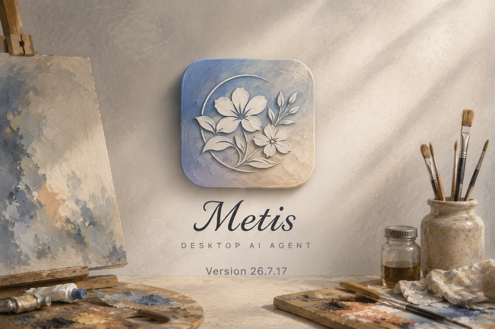
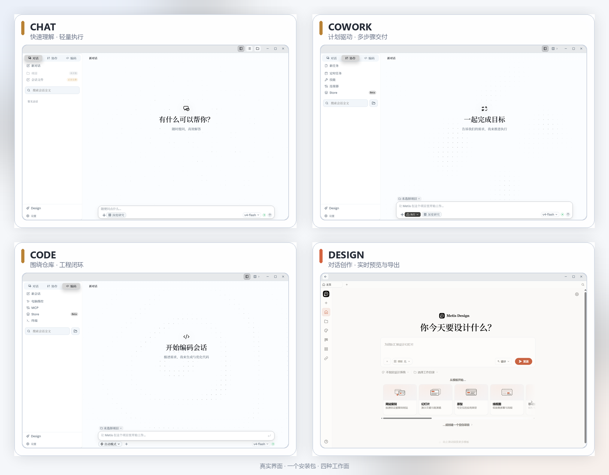
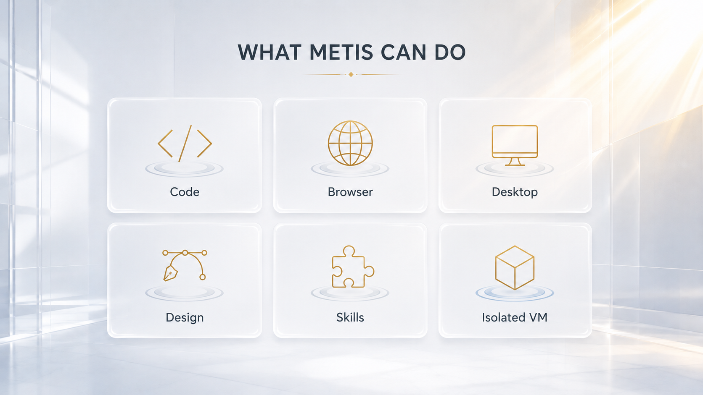
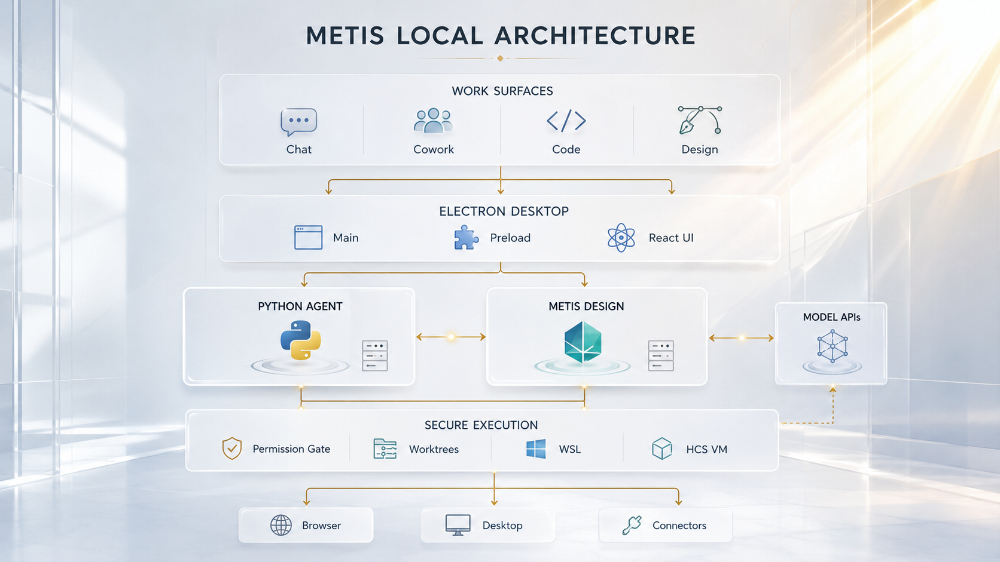

<div align="center">



# Metis

**把模型接入项目、代码、终端、浏览器与 Windows 桌面，让任务从一句话走到可验证的结果。**

<p>
  
  
  
  
  
</p>

<p>
  <a href="https://github.com/linyeping/Metis/releases/download/v26.7.27/Metis-Setup-26.7.27.exe"></a>
  <a href="https://github.com/linyeping/Metis/releases/tag/v26.7.27"></a>
</p>

<sub>Windows 10 / 11 · 64 位 · DeepSeek / OpenAI-compatible API</sub><br />
<sub><a href="README.en.md">English</a> · 由 <a href="https://github.com/linyeping">linyeping</a> 打造 · 产品方向与部分设计思路致谢 <a href="https://github.com/Serein0812">Serein</a></sub>

</div>

<br />

## 四种工作面

Chat、Cowork、Code 与 Design 针对不同任务组织界面和工具，同时共享模型配置、项目上下文、权限策略、连接器与任务通知。

<p align="center">
  
</p>

| 工作面 | 适合处理 | 核心体验 |
|---|---|---|
| **Chat** | 问答、分析、文件理解、轻量执行 | 快速对话、附件上下文、模型切换、工具调用与独立 Side Chat |
| **Cowork** | 调研、整理、计划驱动的多步骤任务 | 计划、子任务、后台运行、研究记录、工具活动和结果汇总 |
| **Code** | 仓库修改、调试、测试、构建与交付 | 项目上下文、Worktree、终端、文件、Diff、网页预览和验证证据 |
| **Design** | 网页、原型、演示文稿、图片与交互内容 | 项目化 Studio、素材、设计系统、实时预览、评论、版本与导出 |

模式之间的会话和草稿相互隔离。切换工作面不会让其它模式的请求、输入或运行状态覆盖当前任务。

---

## 一条完整的任务链路

Metis 不把“模型回复”当作任务终点。一个任务可以在同一窗口内完成：

1. **建立上下文**：选择目录或仓库，添加文件与图片，恢复历史会话，读取项目状态。
2. **确定执行方式**：直接执行、先给计划、使用 Worktree，或进入 WSL / HCS 隔离环境。
3. **持续运行**：调用代码、终端、浏览器、桌面、检索、Skills、Connectors 与 MCP 工具。
4. **检查改动**：在文件卡和多文件 Diff 中逐项审阅，按文件回退不需要的改动。
5. **验证结果**：运行测试和构建，打开本地网页，检查 Windows 应用，保存截图、日志与视觉证据。
6. **交付与恢复**：后台任务、checkpoint、上下文压缩和会话恢复保持长任务连续，最终集中呈现产物与证据。

<div align="center">
  
</div>

---

## 工程工作台

Code 与 Cowork 不只有聊天区。右侧工作台由可组合的工作卡组成，可按任务显示、关闭、调整尺寸并保留布局。

| 工作卡 | 能力 |
|---|---|
| **Files** | 浏览工作区文件，预览文本、图片、PDF 与常见文档 |
| **Diff** | 汇总多文件改动，逐文件切换，显示增删行并执行单文件回退 |
| **Terminal** | 交互式 PTY，支持多终端、重命名、重启、清屏、尺寸调整与 shell 配置 |
| **Web** | 多标签网页预览、前进后退、刷新、缩放、弹窗接管与本地 HTML 预览 |
| **Activity** | 查看 run、子任务、工具调用、状态、耗时、摘要和错误 |
| **Plan** | 展示任务步骤、当前进度和阶段性结果 |
| **Tool** | 检查单次工具调用的输入、输出、错误与产物 |
| **Research** | 汇总检索来源、研究过程和结论 |
| **Session** | 查看当前会话、工作区、分支、执行边界和恢复信息 |

### 预览与验证

- 写入本地 HTML 或检测到开发服务器后，可自动打开网页预览。
- Preview Browser 支持观察、点击、输入、滚动和断言，用真实页面结果验证任务。
- 预览诊断会记录当前 URL、加载状态和近期活动；视觉检查可保存截图证据。
- 文件改动会自动生成 Diff，并把写入、编辑、删除映射到对应文件。

### 并发任务与会话

- 不同会话可以独立运行，离开当前页面后任务继续在后台执行。
- 活动中心统一显示运行中、等待、成功、失败和需要关注的任务。
- 会话支持恢复、重命名、标记未读、归档和删除。
- 忙碌会话有明确状态保护，避免重复提交覆盖正在执行的 run。
- 独立 Side Chat 拥有自己的会话、历史和上下文，不干扰主任务。
- 上下文额度、自动压缩、手动 compact 与 handoff 让长对话保持可继续性。

---

## Metis Design

Metis Design 是面向真实交付的项目工作面。在同一个 Studio 中完成需求描述、素材整理、生成、预览、评论、迭代和导出。

| 能力 | 说明 |
|---|---|
| **项目与标签** | 创建、打开和恢复设计项目；使用浏览器式工作区标签并通过 New tab 开启新工作面 |
| **对话式 Studio** | 左侧与 Agent 协作，右侧查看作品；消息、文件、页面和预览保持在同一项目上下文 |
| **素材与附件** | 管理项目文件、图片、文本与引用素材，并按可见顺序加入生成上下文 |
| **设计系统** | 创建和复用颜色、字体、组件与品牌规则，在不同作品中保持一致性 |
| **真实预览** | 运行网页、桌面/移动端原型、演示文稿、图片和交互内容，而不是只显示静态草图 |
| **视觉评论** | 针对页面、幻灯片或具体区域添加评论，把标注直接带入下一轮修改 |
| **版本与恢复** | 保存项目状态、查看迭代结果并恢复到需要的版本 |
| **导出与交付** | 根据作品类型导出 HTML、PDF、PPTX、图片、Markdown 与项目包，并显示完整进度和结果 |

Design 使用 Metis 当前的模型配置与 API 凭据，并共享主题、语言、任务通知和桌面宠物状态。顶部返回按钮可以随时回到 Metis 主工作台。

---

## 模型、上下文与命令中心

### 模型服务

- 支持 DeepSeek 与 OpenAI-compatible API，可配置自定义 Base URL、API Key 和模型名。
- 从当前 API 读取可用模型目录，在 Composer 或模型面板快速切换。
- 展示上下文窗口、模型类型、提供方信息与可用用量数据。
- Windows 下 API Key 保存在当前用户的 Credential Manager 中，不写入明文配置、聊天记录、日志或模型上下文。
- Design 与其它工作面使用同一套模型配置，无需维护第二套账号或凭据。

### 命令中心

命令中心把全局搜索、系统状态、后台 run 和模型服务放在同一入口：

- 搜索会话、项目和命令，并直接跳转到对应工作面。
- 检查后端、模型、运行时和连接器状态。
- 查看后台 run，恢复仍在执行或已经完成的任务。
- 快速进入模型、权限、终端、运行时与其它设置页面。

---

## Skills、Connectors 与 MCP

| 扩展方式 | 用途 |
|---|---|
| **Skills** | 把稳定的操作步骤、工具选择、校验方式和领域知识封装成可复用工作流 |
| **Connectors** | 连接 GitHub、Slack、Notion、Google Calendar、Google Drive、Gmail、PostgreSQL 与本机文件 |
| **MCP** | 添加外部 MCP Server，把团队或个人工具接入 Agent 工具列表 |
| **Slash commands** | 在 Composer 中快速选择常用模式、工具和工作流 |

连接器中心展示能力说明、来源、授权方式、可用工具和连接状态。OAuth Token 由桌面主进程管理，不进入模型上下文。

<p align="center">
  &nbsp;&nbsp;&nbsp;
  &nbsp;&nbsp;&nbsp;
  &nbsp;&nbsp;&nbsp;
  &nbsp;&nbsp;&nbsp;
  &nbsp;&nbsp;&nbsp;
  &nbsp;&nbsp;&nbsp;
  &nbsp;&nbsp;&nbsp;
  
</p>

---

## 权限与执行环境

### 权限中心

- 按工具、路径和动作设置 `ask`、允许或拒绝规则。
- 搜索和筛选现有规则，手动添加工具规则与授权目录。
- 批量选择、删除、导入、导出并清理冲突规则。
- 工具调用保留状态、摘要和结果，便于审计与问题排查。
- 涉及删除、上传、授权、外部提交或敏感数据时保持显式确认边界。

### 执行边界

| 环境 | 适用场景 |
|---|---|
| **本机工作区** | 需要直接操作当前目录的日常任务 |
| **Git Worktree** | 希望隔离代码改动、并行处理分支或降低对主工作区的影响 |
| **WSL** | 依赖 Linux shell、工具链或运行环境的项目 |
| **HCS VM** | 需要更强隔离、持久会话数据盘和受控 guest 工具链的任务 |

Runtime Manager 提供系统基础能力、运行组件、隔离执行、镜像/资产状态、健康检查、修复命令和诊断包。HCS readiness 会绑定 kernel、initrd、rootfs 与 session-data template 指纹，资产变化后重新验证。

---

## 26.7.27 版本重点

- 新增 Thinking Orbs：根据真实运行事件区分理解任务、检索资料、执行工具与组织回答。
- 运行状态进入当前 AI 回复，与本轮工具活动保持在同一条时间线中，不再占用输入框上方空间。
- 状态提示改为面向任务的自然文案，并保留轮次、步骤与耗时信息。
- 20px 内联动画对齐 Thinking Orbs 原始 64px 演示节奏，兼顾清晰度与长任务观看体验。
- 准备、重试和重连统一使用 Orb；真正失败时直接显示错误标志，不再闪烁心电图图标。
- 排队消息与后台子智能体继续保留在输入区附近，区分当前回复状态和跨任务状态。

---

## 本机架构

<div align="center">
  
</div>

| 层 | 职责 |
|---|---|
| **Electron Desktop** | 窗口、托盘、系统通知、OAuth、原生预览、PTY、后端与 Design runtime 生命周期 |
| **React Workbench** | 四种工作面、会话、Composer、命令中心、工作卡、设置与状态管理 |
| **Python Agent** | Flask + SSE、agent loop、模型路由、工具注册、Skills、checkpoint、连接器和浏览器/桌面自动化 |
| **Execution Runtime** | 本机、Worktree、WSL、HCS VM、运行时资产、诊断和安全边界 |
| **Metis Design Runtime** | 项目、会话、素材、设计系统、实时预览、评论、版本与导出渲染 |

> [!NOTE]
> Renderer 与本机后端通过 HTTP / SSE 通信。API Key 与 OAuth Token 不经过 Metis 中转服务，也不会写入日志或模型上下文。

---

<h2 align="center">下载与首次启动</h2>

<p align="center">
  <a href="https://github.com/linyeping/Metis/releases/download/v26.7.27/Metis-Setup-26.7.27.exe"><b>下载 Metis 26.7.27 for Windows</b></a><br />
  <sub>Windows 10 / 11 · x64 · NSIS 安装程序</sub>
</p>

<table align="center" width="100%">
  <tr>
    <td width="25%" valign="top"><b>1 · 下载</b><br /><br />从 <a href="https://github.com/linyeping/Metis/releases/latest">Latest Release</a> 获取 <code>Metis-Setup-26.7.27.exe</code>。</td>
    <td width="25%" valign="top"><b>2 · 安装</b><br /><br />运行安装程序，选择安装目录并完成桌面快捷方式创建。</td>
    <td width="25%" valign="top"><b>3 · 配置模型</b><br /><br />在设置中选择提供方，填写 API Key，并测试连接或读取模型目录。</td>
    <td width="25%" valign="top"><b>4 · 开始任务</b><br /><br />选择 Chat、Cowork、Code 或 Design；需要时再连接 Skills、MCP 与 Connectors。</td>
  </tr>
</table>

### 运行要求

| 项目 | 当前支持 |
|---|---|
| **系统** | Windows 10 / 11 64 位，x64 处理器 |
| **模型提供方** | DeepSeek、OpenAI、Kimi、智谱 GLM、百炼 / Qwen、豆包、Anthropic、Gemini、Ollama，以及自定义 OpenAI-compatible API |
| **网络** | 模型 API、OAuth / Connectors、外部 MCP、网页访问和按需下载隔离运行时资产时需要联网 |
| **本机依赖** | 安装版本已经包含 Electron、Python backend、Windows runtime service 与 Metis Design runtime；使用者不需要安装 Node.js 或 Python |
| **隔离运行时** | Worktree 直接使用当前 Git；WSL / HCS VM 需要系统具备相应能力，较大的运行时资产按需准备 |
| **自动更新** | 安装版本从 GitHub Releases 检查并下载更新，在应用退出或确认重启后完成安装 |

> [!IMPORTANT]
> 当前安装包尚未代码签名，Windows SmartScreen 可能显示风险提示。请确认下载地址属于 `github.com/linyeping/Metis` 后再运行。Computer Use 会控制鼠标和键盘，涉及外部提交、上传、删除或敏感信息时应先检查权限提示。

---

## 源码开发

```powershell
python -m pip install -e backend/

cd desktop
npm ci
npm run dev
```

开发模式会启动 Vite renderer、Electron desktop shell 和由 Electron launcher 管理的本机 Python backend。Metis Design 位于仓库的 `open-design/` 工作区，并使用同一套桌面开发流程。

### Headless CLI

Metis 也提供面向脚本和 CI 的一次性命令行入口，复用同一套模型解析、agent loop、工具、权限规则与 `metis.agent_event.v1` 事件契约。

```powershell
# 源码运行
"检查当前仓库并给出结论" | python -m backend -p `
  --workspace . `
  --permission-mode plan `
  --output-format stream-json `
  --no-desktop

# 构建不依赖系统 Python / Node.js 的单文件 CLI
cd desktop
npm run build-cli
```

CLI 支持 `text`、单个结果对象 `json` 和逐事件 `stream-json`。非交互任务遇到需要确认的工具动作时不会挂起：它会输出脱敏错误并以退出码 `2` 结束。构建产物为 `desktop/release/metis.exe`；完整参数见 `metis --help`。

独立 CLI 会读取 `~/.metis/config.json`、`~/.metis/settings.json` 和工作区 `.metis/settings.json` 的模型设置。在 Windows 上，桌面端和 CLI 通过当前用户的 Windows Credential Manager 共用 API Key，配置文件不保存明文；旧版 Electron `safeStorage` 和明文配置会在桌面启动后自动迁移。CI 等临时环境仍可通过 `METIS_LLM_API_KEY` 注入，且环境变量优先于系统凭据。

CLI 任务会写入与桌面端相同的会话库，因此可以列出、续接和导出，不会生成一套彼此不可见的“CLI 历史”：

```powershell
metis sessions list
metis sessions show <session-id> --output-format json
metis --resume <session-id-or-prefix> "继续检查未完成项"
metis --continue "接着最近的会话"
metis sessions export <session-id> --format markdown --output session.md
```

JSON 列表、详情和导出分别使用 `metis.cli_sessions.v1`、`metis.cli_session.v1` 与 `metis.session_export.v1`；JSON 导出可以直接复制到另一台机器留档，Markdown 导出适合人工阅读。

桌面应用正在运行时，CLI 还可以把任务交给当前桌面 runtime；agent loop、模型配置、工具状态和权限确认都由桌面实例负责，输出仍保持相同的 `text` / `json` / `stream-json` 契约：

```powershell
metis --attach "检查当前项目"
metis --attach --resume <session-id-or-prefix> "继续"
metis --attach --continue "接着最近的会话"
```

attached run 遇到权限请求时会等待用户在 Metis 桌面端允许或拒绝，而不是像独立 headless run 那样以退出码 `2` 立即结束。CLI 不扫描本机端口；正式桌面 backend 在 `%LOCALAPPDATA%\Metis\runtime` 下使用当前用户 ACL 发布随机令牌和数据目录指针，并在连接时校验 PID、实例 ID、attach 协议与事件 schema。这样即使安装数据目录经过自定义，CLI 仍能找到同一会话库；开发版使用独立发现记录，不覆盖正式版。`--attach` 使用桌面的运行配置，因此不接受模型、权限、policy、工具开关或最大轮次覆盖参数。

CLI 还提供默认只读的环境诊断与独立的沙箱检查/修复入口：

```powershell
metis doctor --output-format json
metis doctor --deep
metis sandbox status --deep
metis sandbox repair
metis sandbox repair --allow-download
```

`doctor` 检查配置、共享凭据是否存在、会话库完整性、workspace 权限、桌面工具、MCP、HCS/VM 服务版本与协议，但不会输出 API Key，也不会修改文件或系统状态。只有显式执行 `sandbox repair` 才会触发幂等修复；下载 runtime pack 还需要额外传入 `--allow-download`。

### 常用验证命令

```powershell
cd desktop

# TypeScript
npm run typecheck

# React / store / runtime 单测
npm run test

# Electron、安全与产品契约测试
npm run test:contracts

# 发布前固定回归
npm run test:fixed-regression

# Design runtime 生命周期检查
npm run test:design-runtime-lifecycle

# 后端全量测试
cd ..
python -m pytest backend/tests/ -q
```

### 构建 Windows 安装包

```powershell
cd desktop
npm run dist:win
```

`dist:win` 会依次执行：

1. 发布前固定回归测试。
2. 使用 PyInstaller 构建 Python backend。
3. 构建 Windows runtime service。
4. 组装 Metis Design runtime 与导出组件。
5. 构建 React / Vite renderer。
6. 使用 electron-builder 生成 NSIS 安装包与 blockmap。

构建产物位于 `desktop/release/`。

---

## 仓库导航

```text
Miro/
├── .github/workflows/       # CI、运行时构建与发布工作流
├── backend/
│   ├── cli/                 # Headless/attach CLI、会话、诊断、输出与权限契约
│   ├── core/                # 配置、常量与共享基础能力
│   ├── bridges/             # 事件、供应商与工具协议桥接
│   ├── runtime/             # agent loop、模型路由、run、checkpoint 与执行环境
│   ├── tools/               # 代码、浏览器、桌面、检索与文档工具
│   ├── web/                 # Flask API、SSE、CLI attach 与 Preview Browser bridge
│   └── tests/               # 后端单元、集成、安全与运行时测试
├── desktop/
│   ├── electron/            # 窗口、托盘、PTY、OAuth、预览与 runtime 生命周期
│   ├── src/                 # React 工作台、状态、设置、i18n 与桌面组件
│   ├── scripts/             # 构建、契约、回归、冒烟与生命周期测试
│   └── resources/           # 图标、后端、service 与 Design 的打包资源
├── open-design/
│   ├── apps/web/            # Metis Design 项目入口与 Studio
│   ├── apps/daemon/         # 项目、会话、Agent、预览与导出服务
│   ├── packages/            # Design 共享组件、协议与运行库
│   ├── skills/              # Design 工作流与创作能力
│   └── tools/               # 开发、测试和跨平台打包工具
├── CONTRIBUTING.md          # 贡献与开发约定
└── README.md / README.en.md
```

日常桌面开发主要集中在 `backend/` 与 `desktop/`；Design 相关改动集中在 `open-design/`，最终由 `desktop/scripts/prepare-design-runtime.mjs` 组装进桌面发布产物。

---

## 隐私与安全

Metis 不要求平台账号。模型服务、连接器和外部工具由用户自行配置，应用不会把这些请求转发到 Metis 中转服务。

| 数据或动作 | 本机处理方式 |
|---|---|
| **项目与会话** | 写入统一数据目录；默认优先使用安装目录下的 `data/`，不可写时回退到 `%LOCALAPPDATA%/Metis/data` |
| **数据目录** | 可通过安装目录的 `data-root.json` 或 `METIS_DATA_ROOT` 调整；`METIS_HOME` 单独覆盖后端工作目录 |
| **模型 API Key** | Windows 下保存到当前用户的 Credential Manager（target：`Metis/LLM/API-Key`），桌面与 CLI 读取同一凭据；旧版 `safeStorage` / 明文配置会迁移后清除 |
| **OAuth 与连接器凭据** | 按服务分别加密保存，只在对应连接器或本机运行时需要时解密使用 |
| **Design 数据采集** | Metis 受管配置关闭 metrics、content 与 artifact manifest telemetry |
| **工具动作** | 权限请求、允许/拒绝结果、运行状态和诊断信息保持可回看 |

### 联网边界

- 调用用户配置的模型 API。
- 连接用户主动启用的 OAuth 服务、Connectors 与外部 MCP Server。
- 下载用户选择的隔离运行时资产或访问任务要求的网页。
- API Key、OAuth Token 和连接器 Token 不加入模型上下文；敏感字段不应出现在诊断包和应用日志中。

### 操作与隔离

- Browser 与 Computer Use 区分读取信息和向外部发送、提交或上传数据。
- 删除、授权、上传、外部提交和敏感数据传输等动作需要经过对应权限边界。
- 权限中心支持按工具、路径和动作管理规则，并提供搜索、批量处理、导入导出和冲突清理。
- 任务可选择本机工作区、Git Worktree、WSL 或 HCS VM；隔离越强，准备成本和环境限制也越高。

---

## 许可证

**[PolyForm Noncommercial 1.0.0](LICENSE)** © 2026 linyeping

源码可见，**个人 / 非商用免费**（学习、研究、个人项目、非营利组织）。

**任何商业用途或商业二次开发，须事先获得作者书面授权（付费）。**

---

<p align="center">
  <b>由 <a href="https://github.com/linyeping">linyeping</a> 打造</b> · 产品方向与部分设计思路致谢：<a href="https://github.com/Serein0812">Serein</a>
</p>

<p align="center">
  <i>且将新火试新茶，诗酒趁年华。</i>
</p>
